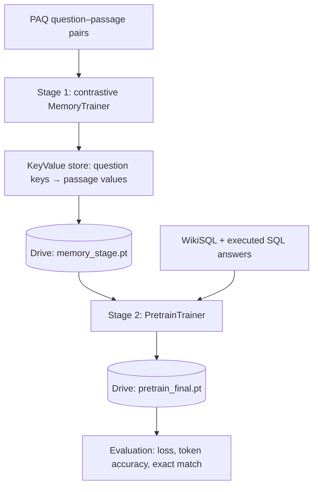

# ECE-570 Project — DoT Model Implementation — TableMind

[](https://www.python.org/downloads/)
[](https://pytorch.org/)
[](https://huggingface.co/transformers/)

An implementation of the DoT (Double Transformer) model for table question answering, extended with an external key-value memory. Training runs in two stages through three Colab-ready notebooks.

## 🎯 Project Overview

- **Pruning transformer (TAPAS):** scores every token of the flattened table and question. The top-k tokens are kept, always including the question, in their original order.
- **Task transformer (T5):** the kept TAPAS tokens are decoded back to text and re-tokenized for T5. Each table word's embedding is scaled by `sigmoid(pruning score)`, so the pruner is trained end to end through the T5 loss.
- **Key-value memory:** a T5 memory encoder, trained contrastively on PAQ question–passage pairs, fills a store of question keys and passage values. The task transformer retrieves a softmax-weighted mix of the top-k values.
- **Targets:** WikiSQL ships SQL queries, not answers, so each query is executed on its table and the result is the T5 target.

## 📁 Repository Structure

```
.
├── src/
│   ├── notebooks/
│   │   ├── 01_memory.ipynb      # Stage 1: contrastive memory training + fill the store
│   │   ├── 02_pretrain.ipynb    # Stage 2: DoT training on WikiSQL
│   │   └── 03_evaluation.ipynb  # Test split: loss, token accuracy, exact match
│   ├── config/
│   │   ├── default.yaml       # t5-base + tapas-large, full experiment
│   │   └── quick.yaml         # t5-small + tapas-small (inherits default.yaml)
│   ├── core/
│   │   ├── memory/
│   │   │   ├── encoder.py     # MemoryEncoder
│   │   │   └── store.py       # KeyValueMemoryStore
│   │   ├── model/
│   │   │   ├── pruning.py     # PruningTransformer (TAPAS)
│   │   │   ├── task.py        # TaskTransformer (memory-augmented T5)
│   │   │   └── dot.py         # DoTModel (prune → re-tokenize → generate)
│   │   └── training/
│   │       ├── base.py              # BaseTrainer (shared optimisation loop)
│   │       ├── memory_trainer.py    # MemoryTrainer (stage 1)
│   │       └── pretrain_trainer.py  # PretrainTrainer (stage 2)
│   └── utils/
│       ├── paq.py             # PAQDataset (streamed question–passage pairs)
│       ├── wikisql.py         # WikiSQLDataset (official release, executed answers)
│       ├── sql.py             # WikiSQL query executor
│       ├── checkpoint.py      # save / load / upload / download checkpoints
│       └── helpers.py         # config loading, seeding, collation, exact match
└── requirements.txt
```

## 🚀 Quick Start (Google Colab)

Run the notebooks in order. Each opens with an **Open in Colab** badge, and its first cell clones this repository and installs the requirements.

1. **[01_memory.ipynb](src/notebooks/01_memory.ipynb):** trains the memory encoder, fills the store, and uploads `memory_stage*.pt`.
2. **[02_pretrain.ipynb](src/notebooks/02_pretrain.ipynb):** loads the memory stage, trains DoT on WikiSQL, and uploads `pretrain_final*.pt`. A `<experiment>_latest.pt` checkpoint is uploaded after every epoch.
3. **[03_evaluation.ipynb](src/notebooks/03_evaluation.ipynb):** loads the trained model and reports test loss, token accuracy and exact match, overall and per aggregation type.

Use **Runtime → Change runtime type → T4 GPU**. Checkpoints pass between notebooks through Google Drive (`MyDrive/TableMind/checkpoints`); you'll be asked to authorize Drive once per session. The notebooks clone the GitHub repository, so push your changes before running them on Colab.

Each notebook selects its configuration in one line:

```python
CONFIG_PATH = "src/config/quick.yaml"   # or "src/config/default.yaml"
```

## 💻 Running Locally

```powershell
python -m venv .venv
.venv\Scripts\Activate.ps1
pip install -r requirements.txt
pip install jupyter
jupyter notebook src/notebooks/
```

Outside Colab, the notebooks switch to the repository root and use `./storage` instead of Google Drive. WikiSQL is downloaded once to `~/.cache/tablemind`; set `TABLEMIND_CACHE` to change that location.

## ⚙️ Configuration

`quick.yaml` names `default.yaml` as its `base:` and overrides only what differs:

```yaml
base: default.yaml

model:
  memory_encoder:
    model_name: "t5-small"
    proj_dim: 128
  pruning_transformer:
    model_name: "google/tapas-small-finetuned-wtq"
    top_k: 64

pretraining:
  num_epochs: 1
  batch_size: 4
```

| Section | Used by | Key settings |
|---|---|---|
| `model` | all stages | model names, `proj_dim`, pruning `top_k`, T5 input `max_length` |
| `data.paq` | stage 1 | `num_examples` (streamed), question/passage lengths, `eval_ratio` |
| `data.wikisql` | stages 2–3 | split names and subset ratios, `answer_max_length` |
| `memory_training` | stage 1 | batch size (in-batch negatives), learning rate, `temperature` |
| `pretraining` | stage 2 | epochs, learning rate, scheduler, gradient accumulation, `memory_top_k` |
| `storage` | all stages | Drive folder and checkpoint names |

## 🏗️ Training Pipeline



Inside `DoTModel.forward`:

1. TAPAS scores each token with its cell-selection head (before temperature scaling and column masking, which would saturate the sigmoid).
2. Padding is excluded, the question segment is always kept, and the top-k positions are taken in their original order.
3. The kept word pieces are merged into words, with `header:` / `row:` / `;` markers, and re-tokenized with the T5 tokenizer.
4. Each table word's T5 embeddings are scaled by `sigmoid(score)`. T5 encodes the result, adds the table embedding and the retrieved memory, and decodes the answer.

## 📈 Performance Notes

- **Quick config** (t5-small + tapas-small, ~125M parameters) fits a free Colab T4.
- **Default config** (t5-base + tapas-large) needs roughly 12–16 GB of GPU memory. If you run out of memory, lower `pretraining.batch_size` and raise `pretraining.gradient_accumulation_steps`.
- Weights-only checkpoints are about 0.5 GB for quick and about 2.5 GB for default. Set `RESUMABLE = True` in `02_pretrain.ipynb` to also save optimizer state, which roughly triples the size.

## 🐛 Troubleshooting

- **`FileNotFoundError: ... run the previous stage's notebook first`:** the checkpoint isn't in the Drive folder. Run the notebooks in order with the same `CONFIG_PATH`.
- **Model download issues:** set `HF_HOME=/path/to/large/disk`, or `HF_HUB_OFFLINE=1` once the models are cached.

## 📝 License & Citation

This project is developed for **ECE-570: Introduction to AI** coursework.

```bibtex
@misc{dot_model_2024,
  title={DoT Model Implementation for Table Question Answering},
  author={ECE-570 Project Team},
  year={2024},
  institution={Purdue University}
}
```

## 🔗 References

- [DoT: An Efficient Double Transformer for NLP Tasks with Tables](https://arxiv.org/abs/2106.00479) - Original DoT paper
- [Transformers Library](https://huggingface.co/transformers/)
- [TAPAS Paper](https://arxiv.org/abs/2004.02349)
- [T5 Paper](https://arxiv.org/abs/1910.10683)
- [WikiSQL Dataset](https://github.com/salesforce/WikiSQL)
- [PAQ: 65 Million Probably-Asked Questions](https://arxiv.org/abs/2102.07033)
