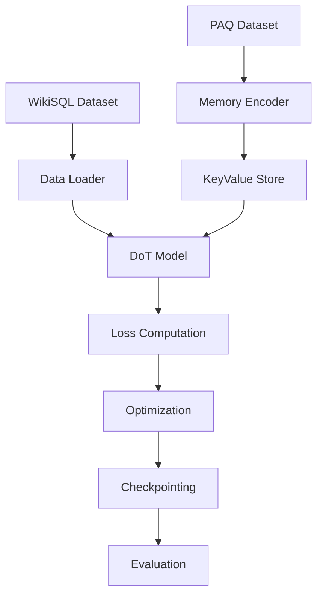

# ECE-570 Project — DoT Model Implementation — TableMind

[](https://www.python.org/downloads/)
[](https://pytorch.org/)
[](https://huggingface.co/transformers/)

A **professionally organized** implementation of the Differentiable Optimized Transformer (DoT) model for table question answering tasks. This project converts the original Jupyter notebook into a modular, configurable, and testable Python package with modern ML engineering practices.

## 🎯 Project Overview

The DoT model implements a hybrid architecture combining:
- **Memory-augmented encoding** using T5 with external key-value storage
- **Pruning mechanism** via TAPAS for candidate selection
- **Task-specific generation** with memory-enhanced T5 decoder

**Key Features:**
- 🏗️ **Modular Architecture**: Clean separation of concerns with pluggable components
- ⚙️ **Configuration-driven**: YAML-based configuration for easy experimentation
- 🧪 **Comprehensive Testing**: Unit tests and integration tests
- 📊 **Professional Training**: Advanced trainer with checkpointing, logging, and metrics
- 🚀 **Easy Deployment**: Command-line interface for training and evaluation
- 📈 **Visualization**: Built-in training curve plotting and metrics tracking

## 📁 Repository Structure

```
.
├── 📁 src/dot_model/          # Main package source code
│   ├── 📁 core/               # Core model components
│   │   ├── memory.py          # Memory encoder & key-value store
│   │   ├── models.py          # Transformer models (Pruning, Task, DoT)
│   │   └── __init__.py
│   ├── 📁 data/               # Dataset loading and preprocessing
│   │   ├── datasets.py        # PAQ and WikiSQL dataset classes
│   │   └── __init__.py
│   ├── 📁 training/           # Training infrastructure
│   │   ├── trainer.py         # Professional trainer class
│   │   ├── utils.py           # Training utilities
│   │   └── __init__.py
│   └── __init__.py            # Package exports
├── 📁 config/                 # Configuration files
│   ├── default.yaml           # Default hyperparameters
│   └── quick.yaml             # Quick experiment config
├── 📁 scripts/                # Command-line interface
│   ├── train.py               # Training script
│   └── evaluate.py            # Evaluation script
├── 📁 tests/                  # Unit and integration tests
│   └── test_models.py         # Model component tests
├── 📁 notebooks/              # Jupyter notebooks (if any)
├── 📄 requirements.txt        # Python dependencies
├── 📄 README.md              # This file
└── 📄 run_training.py         # Legacy simple runner (deprecated)
```

## 🚀 Quick Start

### 1. Environment Setup

```powershell
# Create virtual environment
python -m venv .venv

# Activate environment
.venv\Scripts\Activate.ps1

# Install dependencies
pip install -r requirements.txt
```

### 2. Quick Training Run

```powershell
# Quick experiment (small models, small datasets)
python scripts/train.py --config config/quick.yaml

# Full training with default configuration
python scripts/train.py --config config/default.yaml

# Custom experiment
python scripts/train.py --config config/default.yaml --experiment-name my_experiment
```

### 3. Evaluation

```powershell
# Evaluate a trained model
python scripts/evaluate.py --checkpoint checkpoints/my_experiment_final.pt
```

## ⚙️ Configuration

The project uses YAML configuration files for easy experimentation:

```yaml
# Example config/quick.yaml
model:
  memory_encoder:
    model_name: "t5-small"
    proj_dim: 128
  pruning_transformer:
    top_k: 64

training:
  num_epochs: 1
  batch_size: 4
  learning_rate: 5e-5

data:
  paq:
    subset_ratio: 0.001  # Use 0.1% for quick testing
```

## 🏗️ Architecture Deep Dive

### Core Components

1. **Memory System** (`src/dot_model/core/memory.py`)
   - `MemoryEncoder`: T5-based encoder with key-value projections
   - `KeyValueMemoryStore`: CPU-backed storage with similarity retrieval

2. **Model Components** (`src/dot_model/core/models.py`)
   - `PruningTransformer`: TAPAS-based candidate scoring
   - `TaskTransformer`: Memory-augmented T5 generation
   - `DoTModel`: Complete pipeline integration

3. **Data Pipeline** (`src/dot_model/data/datasets.py`)
   - `PAQDataset`: Question-answer pairs for memory population
   - `WikiSQLDataset`: Table QA with robust preprocessing

4. **Training Infrastructure** (`src/dot_model/training/`)
   - `DoTTrainer`: Professional trainer with checkpointing
   - Utilities for data collation and memory encoding

### Training Pipeline



## 🧪 Testing

Run the test suite to verify installation:

```powershell
# Run all tests
python -m pytest tests/ -v

# Run specific test module
python tests/test_models.py
```

## 📊 Experiment Tracking

The trainer automatically tracks:
- ✅ Training/validation losses
- ✅ Token-level accuracy metrics  
- ✅ Learning rate schedules
- ✅ Model checkpoints
- ✅ Training curve visualizations

Results are saved to:
- `checkpoints/`: Model checkpoints
- `outputs/`: Training curves and logs

## 🔧 Advanced Usage

### Custom Model Components

```python
from dot_model import MemoryEncoder, KeyValueMemoryStore, DoTModel

# Initialize with custom configurations
memory_encoder = MemoryEncoder(
    model_name='t5-large',
    proj_dim=512
)

memory_store = KeyValueMemoryStore()
model = DoTModel(memory_store, memory_encoder, k=256)
```

### Distributed Training

The trainer supports single-GPU training out of the box. For multi-GPU:

```python
# Wrap model with DataParallel (basic multi-GPU)
model = torch.nn.DataParallel(model)

# Or use DistributedDataParallel for better performance
# Implementation left as exercise for distributed setups
```

## 📈 Performance Notes

**Expected Resource Usage:**
- **Quick Config** (t5-small + tapas-small): ~4-8GB GPU memory, suitable for experimentation
- **Default Config** (t5-base + tapas-large): ~12-16GB GPU memory, recommended for full training
- **Training Time**: Highly dependent on dataset size, hardware, and configuration

**Important Notes:**
- Actual performance varies significantly based on hardware and dataset subsets
- Memory usage depends on batch size, sequence length, and model combinations
- Use the quick config for initial testing and development
- Benchmark your specific setup with small datasets first

*Performance will vary based on your hardware and configuration*

## 🐛 Troubleshooting

### Common Issues

**OOM Errors:**
```bash
# Reduce batch size in config
training:
  batch_size: 2  # Instead of 8
  
# Or use gradient accumulation
training:
  gradient_accumulation_steps: 4
```

**Model Download Issues:**
```bash
# Set HuggingFace cache directory
export HF_HOME=/path/to/large/disk

# Or use offline mode
export TRANSFORMERS_OFFLINE=1
```

**Import Errors:**
```bash
# Ensure proper Python path
export PYTHONPATH="${PYTHONPATH}:$(pwd)/src"
```

## 🤝 Contributing

1. **Code Style**: Follow PEP 8, use `black` for formatting
2. **Testing**: Add tests for new components
3. **Documentation**: Update docstrings and README
4. **Configuration**: Use YAML configs, avoid hardcoded values

## 📝 License & Citation

This project is developed for **ECE-570: Introduction to AI** coursework.

```bibtex
@misc{dot_model_2024,
  title={DoT Model Implementation for Table Question Answering},
  author={ECE-570 Project Team},
  year={2024},
  institution={Purdue University}
}
```

## 🔗 References

- [DoT: An Efficient Double Transformer for NLP Tasks with Tables](https://arxiv.org/abs/2106.00479) - Original DoT paper
- [Transformers Library](https://huggingface.co/transformers/)
- [TAPAS Paper](https://arxiv.org/abs/2004.02349)
- [T5 Paper](https://arxiv.org/abs/1910.10683)
- [WikiSQL Dataset](https://github.com/salesforce/WikiSQL)

---

**🎓 Educational Note**: This implementation prioritizes code clarity and educational value over production optimization. For production use, consider additional optimizations like model quantization, ONNX export, and distributed inference.

