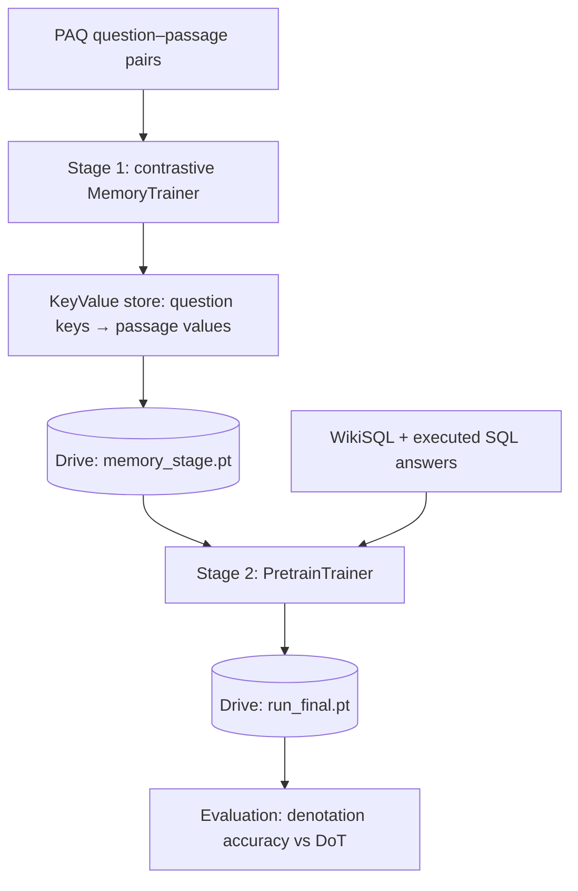

# ECE-570 Project — DoT Model Implementation — TableMind

[](https://www.python.org/downloads/)
[](https://pytorch.org/)
[](https://huggingface.co/transformers/)

A reimplementation of DoT (Double Transformer, [Krichene et al., 2021](https://arxiv.org/abs/2106.00479)) for table question answering. DoT's second, large TAPAS is replaced by a **T5** task model, and the model is extended with an external **key-value memory**. Training runs in two stages through three Colab-ready notebooks.

## 🎯 Project Overview

- **Pruning transformer (TAPAS-small):** scores every token of the 1024-token flattened table and question. Whole cells are kept, highest mean score first, until 256 tokens are used. The question and header row are always kept. This follows DoT's small → 256 → large setup, with cells instead of single tokens.
- **Task transformer (T5):** the kept TAPAS tokens are decoded back to text and re-tokenized for T5. Each kept cell's embeddings are scaled by `sigmoid(cell score)`, so the pruner is trained end to end through the T5 loss.
- **Key-value memory:** a T5 memory encoder, trained contrastively on PAQ question–passage pairs, fills a store of question keys and passage values. The task transformer retrieves a softmax-weighted mix of the top-k values. It can be switched off (`use_memory: false`) for an ablation.
- **Targets and metric:** WikiSQL ships SQL queries, not answers, so each query is executed on its table and the result is the T5 target, as in DoT's weakly supervised setting. Models are scored with **denotation accuracy**, the metric DoT reports.

## 📁 Repository Structure

```
.
├── src/
│   ├── notebooks/
│   │   ├── 01_memory.ipynb      # Stage 1: contrastive memory training + fill the store
│   │   ├── 02_pretrain.ipynb    # Stage 2: DoT training on WikiSQL
│   │   └── 03_evaluation.ipynb  # Test split: denotation accuracy, comparison with DoT
│   ├── config/
│   │   └── default.yaml         # the experiment configuration
│   ├── core/
│   │   ├── memory/
│   │   │   ├── encoder.py       # MemoryEncoder
│   │   │   └── store.py         # KeyValueMemoryStore
│   │   ├── model/
│   │   │   ├── pruning.py       # PruningTransformer (TAPAS)
│   │   │   ├── task.py          # TaskTransformer (memory-augmented T5)
│   │   │   └── dot.py           # DoTModel (cell pruning → re-tokenize → generate)
│   │   └── training/
│   │       ├── base.py              # BaseTrainer (shared optimisation loop)
│   │       ├── memory_trainer.py    # MemoryTrainer (stage 1)
│   │       └── pretrain_trainer.py  # PretrainTrainer (stage 2)
│   └── utils/
│       ├── paq.py               # PAQDataset (streamed question–passage pairs)
│       ├── wikisql.py           # WikiSQLDataset (official release, executed answers)
│       ├── sql.py               # WikiSQL query executor
│       ├── metrics.py           # denotation accuracy and exact match
│       ├── checkpoint.py        # save / load / upload / download checkpoints
│       └── helpers.py           # config loading, seeding, collation, run names
└── requirements.txt
```

## 🚀 Running on Google Colab

Run the notebooks in order. Each opens with an **Open in Colab** badge, and its first cell clones this repository and installs the requirements.

1. **[01_memory.ipynb](src/notebooks/01_memory.ipynb):** trains the memory encoder, fills the store, and uploads `memory_stage.pt`. Run it once; every pretraining run reuses it.
2. **[02_pretrain.ipynb](src/notebooks/02_pretrain.ipynb):** loads the memory stage, trains DoT on the full WikiSQL training set, and uploads `<run>_final.pt`. A `<run>_latest.pt` checkpoint is uploaded after every epoch.
3. **[03_evaluation.ipynb](src/notebooks/03_evaluation.ipynb):** scores a run on the full test split (denotation accuracy, exact match, per-aggregation breakdown). It uploads `<run>_results.json` and compares all runs found in Drive with the DoT paper.

Use **Runtime → Change runtime type → T4 GPU**. Checkpoints pass between notebooks through Google Drive (`MyDrive/TableMind/checkpoints`); you'll be asked to authorize Drive once per session. The notebooks clone the GitHub repository, so push your changes before running them on Colab.

### Experiment protocol
DoT reports the **median of 3 runs**. Notebooks 2 and 3 share a *Run settings* cell:

```python
SEED = 42          # repeat with 43 and 44
USE_MEMORY = True  # False = ablation without memory retrieval
```

Each combination is a separate run, named for example `dot_t5_memory_seed42` or `dot_t5_memory_no_memory_seed43`, so checkpoints never overwrite each other. For the full comparison, train and evaluate all 6 runs (3 seeds × memory on/off). The last cell of `03_evaluation.ipynb` then shows the median per setting next to the paper's numbers:

| Model (WikiSQL test, denotation accuracy) | Paper |
|---|---|
| TAPAS large, 512 tokens | 83.6 |
| TAPAS large, 1024 tokens | 86.0 |
| DoT small → 256 → large (HEM) | 85.3 |
| DoT medium → 256 → large (HEM) | 85.5 |

## 💻 Running Locally

```powershell
python -m venv .venv
.venv\Scripts\Activate.ps1
pip install -r requirements.txt
pip install jupyter
jupyter notebook src/notebooks/
```

Outside Colab, the notebooks switch to the repository root and use `./storage` instead of Google Drive. WikiSQL is downloaded once to `~/.cache/tablemind`; set `TABLEMIND_CACHE` to change that location.

## ⚙️ Configuration

`src/config/default.yaml` is the single configuration:

| Setting | Value | DoT paper |
|---|---|---|
| Pruning transformer | `google/tapas-small-finetuned-wtq` (4 layers) | TAPAS small or medium |
| Input → kept tokens | 1024 → 256 (whole cells) | 1024 → 256 (tokens) |
| Task transformer | `t5-base` + key-value memory | TAPAS large (24 layers) |
| Training data | full WikiSQL train set, 3 epochs (~21k steps, batch size 8) | full train set, 50k steps |
| Evaluation | full test set, denotation accuracy, 3 seeds | same |

The task model is t5-base rather than t5-large because training t5-large with AdamW in fp32 would not fit a 16 GB T4.

| Section | Used by | Key settings |
|---|---|---|
| `model` | all stages | model names, `proj_dim`, pruning `top_k`, T5 input `max_length`, `use_memory` |
| `data.paq` | stage 1 | `num_examples` (streamed), question/passage lengths, `eval_ratio` |
| `data.wikisql` | stages 2–3 | split names and subset ratios, TAPAS `max_length`, `answer_max_length` |
| `memory_training` | stage 1 | batch size (in-batch negatives), learning rate, `temperature` |
| `pretraining` | stage 2 | epochs, learning rate, scheduler, gradient accumulation, `memory_top_k` |
| `storage` | all stages | Drive folder and memory checkpoint name |

## 🏗️ Training Pipeline



Inside `DoTModel.forward`:

1. TAPAS scores each token with its cell-selection head (before temperature scaling and column masking, which would saturate the sigmoid). Each cell's score is the mean of its tokens' scores.
2. The question and header row are kept; body cells are added whole, highest score first, while they fit in the 256-token budget. Padding is never selected and the original order is preserved.
3. The kept word pieces are merged into words, with `header:` / `row:` / `;` markers, and re-tokenized with the T5 tokenizer.
4. Each body cell's T5 embeddings are scaled by `sigmoid(cell score)`. T5 encodes the result, adds the table embedding and the retrieved memory, and decodes the answer. Multi-row answers are separated by ` | `.

## 📈 Performance Notes

- Training uses t5-base (task model), t5-base (memory encoder) and tapas-small at batch size 8. If a T4 runs out of memory, set `pretraining.batch_size: 4` and `gradient_accumulation_steps: 2`.
- One epoch over the full training set is about 7,000 optimizer steps; plan on several hours for 3 epochs on a T4. Colab Pro avoids session time limits. `<run>_latest.pt` is uploaded after every epoch.
- Weights-only checkpoints are about 1.5 GB (≈360M parameters in fp32, plus the memory store). Set `RESUMABLE = True` in `02_pretrain.ipynb` to also save optimizer state, which roughly triples the size.

## 🐛 Troubleshooting

- **`FileNotFoundError: ... run the previous stage's notebook first`:** the checkpoint isn't in the Drive folder. Run the notebooks in order, with the same `SEED` and `USE_MEMORY` in notebooks 2 and 3.
- **CUDA device-side assert:** after one, the GPU context is unusable. Use **Runtime → Disconnect and delete runtime** before re-running.
- **Model download issues:** set `HF_HOME=/path/to/large/disk`, or `HF_HUB_OFFLINE=1` once the models are cached.

## 📝 License & Citation

This project is developed for **ECE-570: Introduction to AI** coursework.

```bibtex
@misc{dot_model_2024,
  title={DoT Model Implementation for Table Question Answering},
  author={ECE-570 Project Team},
  year={2024},
  institution={Purdue University}
}
```

## 🔗 References

- [DoT: An Efficient Double Transformer for NLP Tasks with Tables](https://arxiv.org/abs/2106.00479) - Original DoT paper
- [Transformers Library](https://huggingface.co/transformers/)
- [TAPAS Paper](https://arxiv.org/abs/2004.02349)
- [T5 Paper](https://arxiv.org/abs/1910.10683)
- [WikiSQL Dataset](https://github.com/salesforce/WikiSQL)
- [PAQ: 65 Million Probably-Asked Questions](https://arxiv.org/abs/2102.07033)
